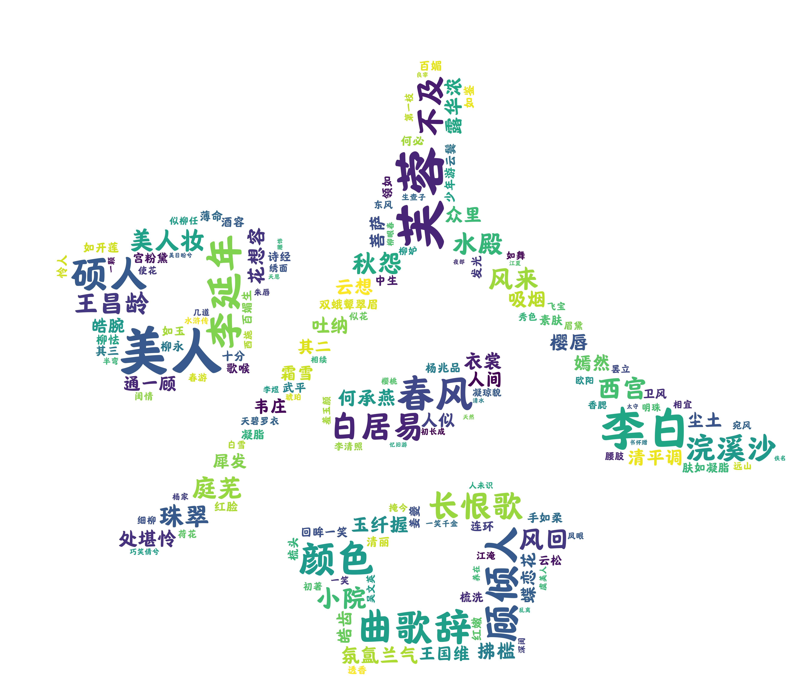
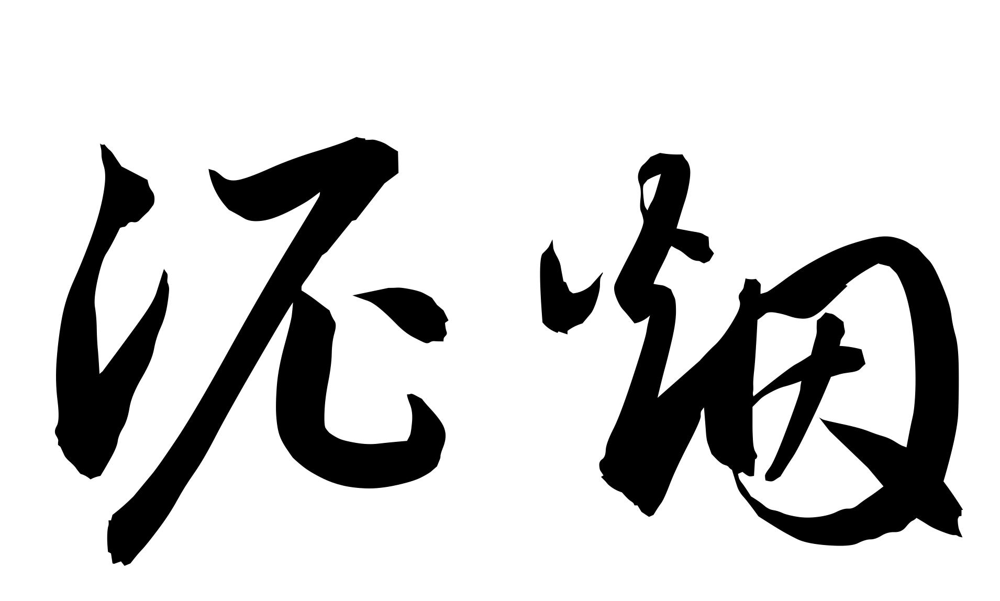

## 《人云亦云》(Draw what you say)

> @author: **[Knight02](https://gitee.com/knight-02)** 

> *听古人云,* 
>
> *跨越古今,* 
>
> *目光所及,* 
>
> *同一片山河,*
>
> *同一轮明月,*
>
> *写下他**or**她的名字*
>
> *赋予这时代落幕,诗篇由在的韵味*

### 使用说明

- **支持环境:Windows10**
- **将项目clone到本地后,点击exe文件即可使用**
- **如果在使用过程中出现任何意外错误,希望您能给予作者反馈♥ 邮箱:tsjkhtfoxmail.com**

### 2022/4/14

> * 词云形状绘制
> 
>* 英汉字均可作为词云形状,图片比例正常

> 
> 
>/0/abcd之云.jpg)
> 
> 
> 
> /0/哈哈之云.jpg)
> 
>
> 
>
> 

### 2022/4/15

> * 爬虫设置完毕
> 
>* 可以自选诗句类型作为诗云的取材

### 流程

> #### 1.对象输入
>
> /1/对象输入.png)
>
> #### 2.风格选择
>
> /1/风格选择.png)
>
> #### 3.生成步骤
>
> /1/流程展示.png)
>
> #### 4.output目录下文件生成
>
> /1/成果图.jpg)

### 部分文件说明

* **draw what you say.exe**:可执行程序

* **font**:字体库, 也可以自行导入其他风格的字体

* **material**:目前放置了方便爬取的种类"kinds.txt"

* **output**:输出的结果都在这里

* **main.py**:程序入口

* **PicAndCloud.py**:

  **内置函数:**

  * **make_cloud(fileName, poemText)** 

  * **create_pic(text, ...)**:text为所要要描述的对象名称, 其余为默认参数, 该函数可以在output目录下生成一个字体轮廓

    如👇

    

* **SpyderForMaterial.py**:
  * **get_text(kindName, kind_char='a')**:kindName为用户输入的风格, kind_char与风格所属的大类有关(URL的属性名有 &tstr=  &astr=  &cstr=  &xstr=,这里需要预判一下)

### 版权声明

* 所用字体包均来自: **北京汉仪创新科技股份有限公司**, 非商用
* 诗文素材均爬取自:[古诗文网-古诗文经典传承 (gushiwen.cn)](https://www.gushiwen.cn/), 爬取强度低, 仅供交流学习

### 关于作者

CSDN:[泥烟](https://blog.csdn.net/qq_39391544)

邮箱:tsjkht@foxmail.com
